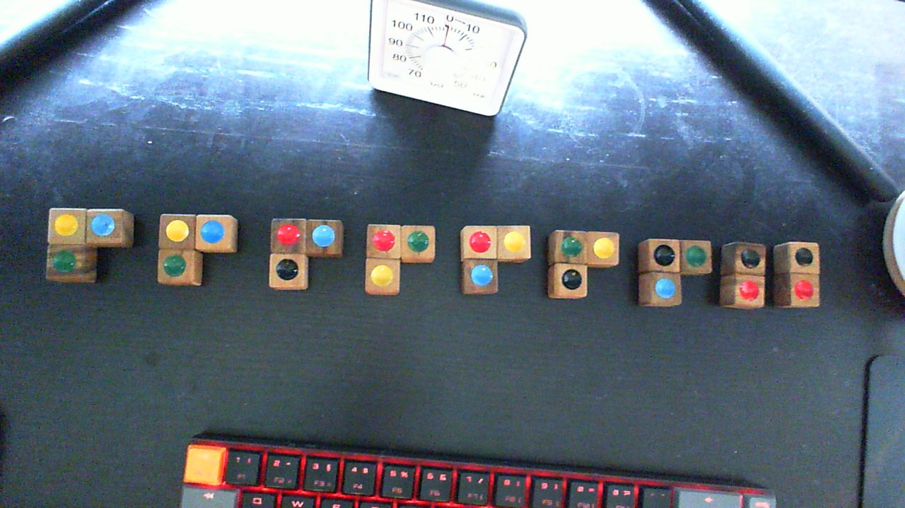
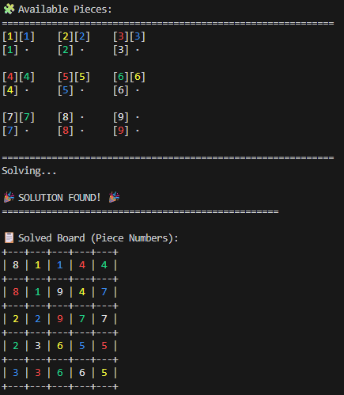
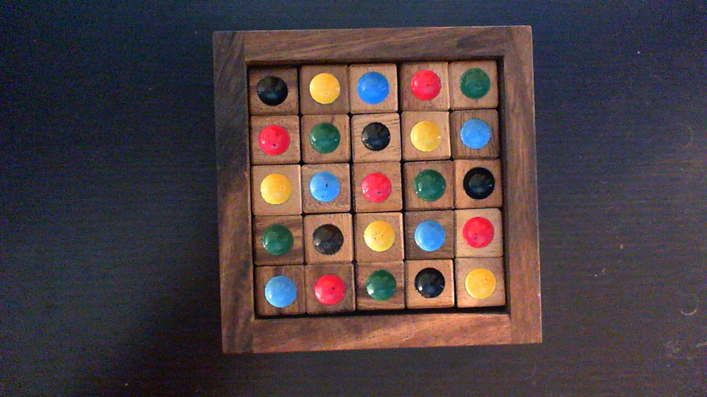

# Wood Sudoku Solver 🧩

An intelligent solver for wooden puzzle games with Sudoku-like color constraints.

## 1. The Wooden Puzzle Game

This puzzle consists of 9 wooden pieces that must fit perfectly into a 5×5 grid:



**Game Rules:**
- **Physical Constraint**: All 9 pieces must fit without gaps or overlaps
- **Sudoku Constraint**: Each row and column must contain all 5 colors exactly once
- **Piece Shapes**: 7 L-shaped pieces (3 cells each) + 2 I-shaped pieces (2 cells each)
- **Colors**: Red, Green, Blue, Black, Yellow

Think of it as Tetris meets Sudoku - you need both geometric fitting AND color logic!

## 2. Why Backtracking?

**Backtracking** is the natural approach for this puzzle:

1. **Try** placing a piece at some position and rotation
2. **Check** if it violates any constraints (overlaps, color conflicts)
3. **If valid**: Continue with the next piece
4. **If invalid**: Remove the piece and try a different placement
5. **Repeat** until all pieces are placed (solution!) or no options remain (backtrack further)

### Visual Example: How Backtracking Explores Solutions

```
Start: Empty 5×5 board
│
├─ Try Piece 1 at position A
│  │
│  ├─ Try Piece 2 at position X
│  │  │
│  │  ├─ Try Piece 3 at position M → ❌ Color conflict!
│  │  │                               ↑ BACKTRACK
│  │  ├─ Try Piece 3 at position N → ❌ Overlap!
│  │  │                               ↑ BACKTRACK  
│  │  └─ Try Piece 3 at position O → ✅ Valid, continue...
│  │     │
│  │     ├─ Try Piece 4... → Eventually fails
│  │     └─ BACKTRACK to Piece 2
│  │         ↑ Remove Piece 3, try Piece 2 elsewhere
│  │
│  ├─ Try Piece 2 at position Y → ✅ Found better path...
│  │  └─ Continue placing remaining pieces → ✅ SOLUTION!
│  │
│  └─ (Never reached - solution found above)
│
└─ (Never reached - solution found above)
```

**Key Insight**: Backtracking systematically explores the "tree of possibilities" but **abandons entire branches** as soon as they're proven impossible. This prevents wasting time on dead ends.

This systematic "try and undo" approach guarantees finding a solution if one exists.

## 3. The Naive Backtracking Problem

**Simple calculation shows why brute force fails:**

- Each piece: 25 positions × 4 rotations = 100 placements
- 9 pieces: 100^9 = 10^18 total combinations

**Even with 90% eliminated by basic constraints:**
- Remaining: 10^17 combinations

**Time estimates on consumer hardware:**
- Modern CPU (~1M attempts/second): **3,000+ years!** 🤯
- Optimistic estimate (~10M attempts/second): Still **300+ years**
- Even at unrealistic 1B attempts/second: Still **3+ years**

**The exponential explosion makes naive backtracking hopeless.**

## 4. Intelligent Algorithms to the Rescue

This solver uses **Constraint Satisfaction Problem (CSP)** techniques to reduce the search from years to seconds:

### **🎯 Most Constrained Variable (MRV)**
**What it means**: Always work on the piece that has the fewest remaining valid placements.

**Why this works**: If a piece can only go in 2 places, deal with it immediately. If you wait, those 2 spots might get taken by other pieces, making the puzzle impossible to solve.

**Simple Example**:
```
Current board state:
- Piece A: Can be placed in 15 different ways
- Piece B: Can be placed in 3 different ways  
- Piece C: Can be placed in 8 different ways

❌ Random order: Try A first (15 options to explore)
✅ MRV order: Try B first (only 3 options to check)

Why? If B fails in all 3 spots, you know immediately this path 
is impossible. No point trying A's 15 options first.
```

**Real-world thinking**: When solving a jigsaw puzzle, you don't start with pieces that could go anywhere. You start with corner pieces (very constrained) or distinctive pieces that clearly belong in specific spots.

### **🔄 Least Constraining Value (LCV)**  
**What it means**: Among valid placements for a piece, choose the one that leaves the most options for remaining pieces.

**Why this works (counter-intuitive!)**: You want to preserve flexibility for future decisions. Eliminating options too aggressively early can force you into dead ends later.

**Example**: 
```
Piece A can go at position X (leaves 50 options for other pieces)
Piece A can go at position Y (leaves 10 options for other pieces)

❌ Wrong thinking: "Choose Y to eliminate branches faster"
✅ Correct: Choose X to keep maximum flexibility

Why? If you choose Y and get stuck later, you've wasted time exploring
the reduced search space. Position X might lead to a solution that
position Y makes impossible to find.
```

### **⚡ Forward Checking**
**What it means**: After placing each piece, immediately check if remaining pieces can still be placed somewhere.

**Example**: You place a RED piece in row 1. Forward checking instantly sees that another piece with RED can no longer be placed in row 1, eliminating many possibilities before trying them.

### **🧠 Arc Consistency**
**What it means**: Before even starting to solve, eliminate placements that can never work due to basic constraints.

**Why this works**: Don't waste time during solving to check obviously impossible moves. Do the obvious eliminations upfront.

**Geometric Examples**:
```
❌ L-shaped piece at position (4,4): Would need cells (4,4), (4,5), (5,4) 
   But (4,5) and (5,4) are outside the 5×5 board (valid positions are 0-4)!

❌ L-shaped piece at position (3,4): Would need cells (3,4), (3,5), (4,4)
   But (3,5) is outside the board!

✅ Pre-eliminate: Remove all positions that cause pieces to go out-of-bounds
```

**Color Constraint Examples**:
```
❌ Piece with RED-BLUE colors in row that already has RED and BLUE
   This will ALWAYS create a duplicate color violation

❌ Two identical pieces (like pieces 1 & 2) both trying to use same cells
   Physical impossibility - can't have two pieces in same space

✅ Pre-eliminate: Remove placements that guarantee constraint violations
```

**Real-world thinking**: Before starting a jigsaw puzzle, you separate edge pieces from middle pieces, and group by color/pattern. You don't keep trying to fit an edge piece in the middle during solving - you eliminate those possibilities upfront.

**The Result**: Instead of checking 10^18 theoretical combinations during search, Arc Consistency reduces it to only valid geometric and color-compatible placements before the solver even starts.

### **📊 Results**
These optimizations reduce the effective search space from 10^17 to ~1,850 attempts:

**Naive backtracking**: 3,000+ years  
**Intelligent backtracking**: ~1 second ⚡

## usage
just modify the variable `PIECE_STRUCTURES` to your wooden pieces and start the main.py file.
No external packages needed, thus no virtual environment.

### desired output
my puzzle has this output 

 

and this transfered to this physical solution 




Happy Puzzling!